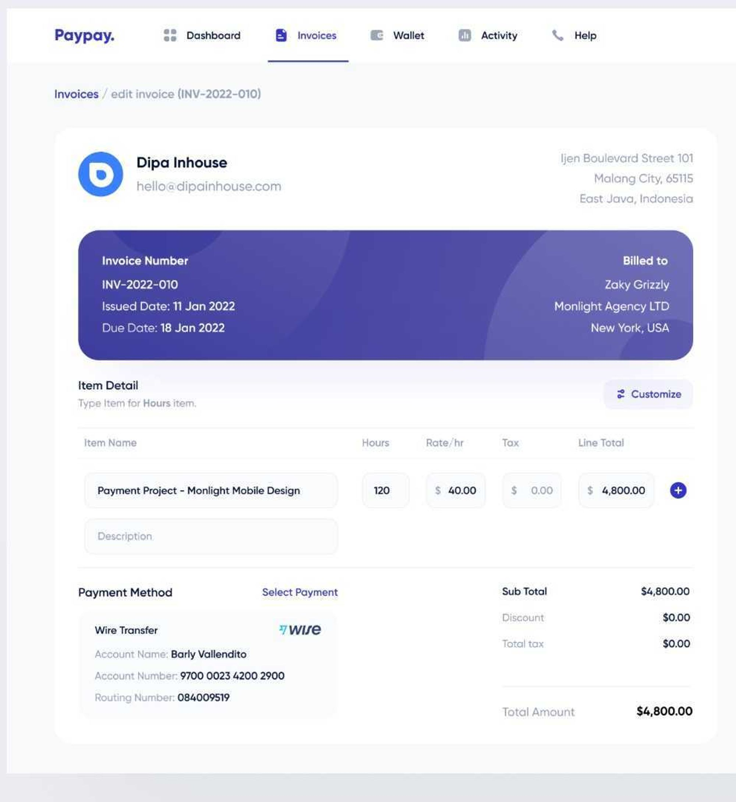
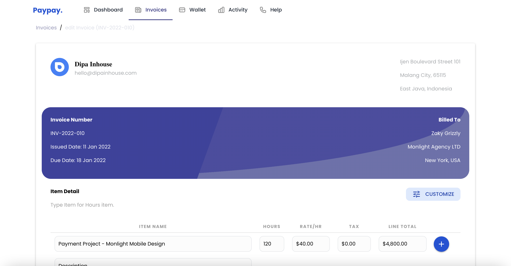

# Paypay OurPass Frontend Assessment

## API summary

This project is meant to recreate the follow mockup

# Features of the project

- use Mirage.js to create a mock API for GET requests,
- use Poppins as font family
- the application must be responsivee on mobile devices
- use Vuex for state management

## Screenshots

Image from for mock API



Image from my implementation



## This project was built With

- JavaScript
- Quasar Framework
- HTML & CSS
- Mirage JS
- Vuex
- Vuex-persist
- Vue-router
- Linting
- Yarn package manager

### Prerequisites

- IDE to edit and run the code (Visual Studio Code or Sublime Text 🔥).
- [Node.js](https://nodejs.org/en/download/) already downloaded.

## Getting started

Clone the project to your local machine. In the project directory, you can run:

### `yarn`

This will install the project dependencies

## Start the development server

### `quasar dev`

Runs the app in the development mode.\
Open [http://localhost:9001](http://localhost:9001) to view it in your browser if thee browser did not open automatically.

The page will reload when you make changes.\
You may also see any lint errors in the console.

### Lint the files

```bash
yarn lint
# or
npm run lint
```

### Format the files

```bash
yarn format
# or
npm run format
```

### Build the app for production

```bash
quasar build
```

## Author 👤

👨‍💻 **Akoke Victor Anto**

- Github: [antoHero](https://github.com/antoHero)
- Twitter: [@\_iam_veecktor](https://twitter.com/Iam_veecktor)
- Linkedin: [akoke-anto](https://www.linkedin.com/in/akoke-anto/)
